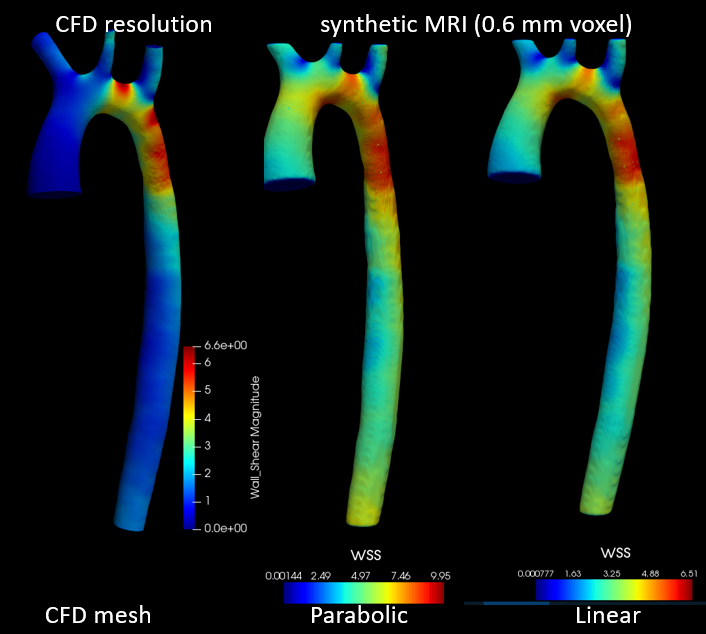
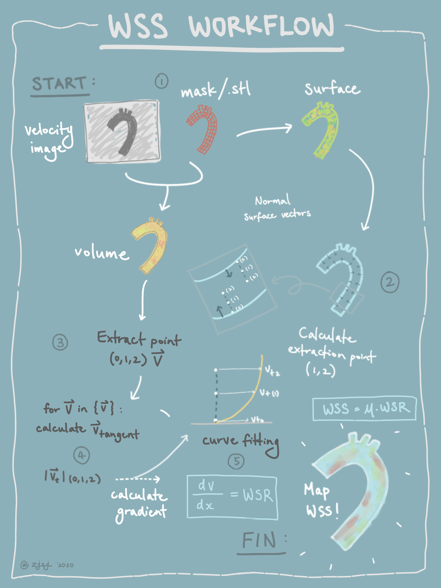
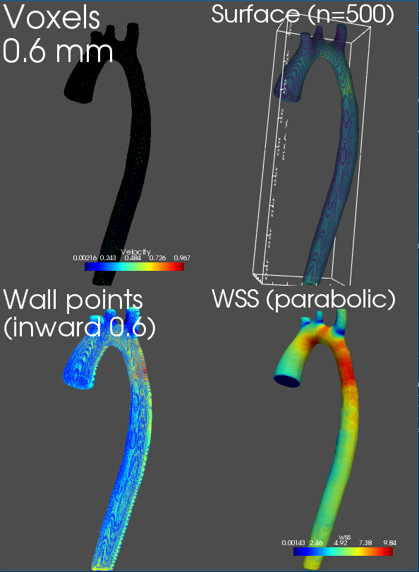

# WSS calculator for MRI
Wall shear stress (WSS) calculation for 4D Flow MRI. 
This is an implementation of the paper 
[Assessment of the accuracy of MRI wall shear stress estimation using numerical simulations](https://onlinelibrary.wiley.com/doi/full/10.1002/jmri.23610)

# Comparison with CFD ground truth

The geometry used in this example was taken from the [2nd CFD Challenge MICCAI 2013](http://www.vascularmodel.org/miccai2013/). CFD simulation is performed using Ansys.

A comparison between the WSS computed using CFD (ground truth) and the ones produced by the script. The synthetic MRI velocity images contained in the example data file with a voxel size of 0.59375 mm.

# Dependencies
The complete requirements can be found in requirements.txt.

Our code relies heavily on the PyVista library.

# Running the demo
Clone the repository

    git clone https://github.com/EdwardFerdian/wss_mri_calculator.git

Go to the src directory and run the script. An example data file has been provided under data/

    cd src/
    python calculate_wss.py

# Arguments
| **Option** | Description |
| --- | --- |
| --input-file | Phase images or velocity vectors, containing u,v,w vector values|
| --mask-file | Mask/segmentation file. Can also be a .stl with another loader)
| --voxel-size | Voxel size, assumed to be isotropic (in mm)
| --inward-distance  | Inward normal distance to sample points from wall (in mm)
| --smoothing | Number of iterations to smooth surface using Laplacian smoothing.
| --parabolic | Use parabolic curve fitting to determine the slope. When False use linear.
| --no-slip | Set the wall velocity to zero for WSS calculation
| --viscosity | Fluid viscosity (default is 4 centiPoise - blood viscosity)
| --show-plot | Plot the images using PyVista plotter
| --show-wss-contours | Show WSS contours for visualization
| --save-to-vtk |  Save volume mesh and surface WSS in vtk file
| --vtk-filename | Prefix for the output file when save_to_vtk is 
| --loglevel |Logging level

# Supported methods
We implemented 3 of the methods explained in the paper:

1. **Linear extrapolation method (Vel-LE method)**
    
    We can simulate this method by setting the options to the following. This option is not recommended. Linear interpolation is performed and velocity on the wall retrieved from the surface, which depends greatly on the segmentation.

        python calculate_wss.py --parabolic False --no-slip False

2. **Velocity-based method using wall position (Vel-Wall)**
    
    Velocity on the wall set to zero (default option) and linear interpolation is used from the wall points to the inward equidistant points.

        python calculate_wss.py --parabolic False

3. **Velocity-based method using parabolic fitting (DEFAULT)**

    Velocity on the wall set to zero (default option) and n-1 polynomial is used to fit the curve (default option)

        python calculate_wss.py

# Workflow

Created by: @zjzj

# Input and output file
The current code accepts and hdf5 file. You have to define your own data_loader to support different file formats. The input file consists of velocity vectors represented as separate components (similar to 4D Flow MRI), as u, v, w representing velocity in x, y, and z direction. A non-binary mask is also provided with the same dimension of the velocity map.

The script shows the plot of the extracted volume, surface, extracted equidistant inward normal points (for WSS calculation), and the WSS surface map.

An option to save the extracted volume and surface as a .vtk file is also provided.

# Statement
This software is for research purposes only.

Please contact us for the licence of commercial purposes. 

All rights are preserved.